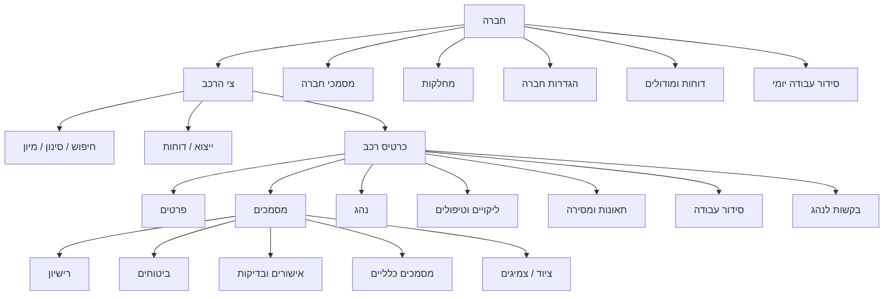

# מפת מערכת מפורטת — cars-app.co.il

מסמך קריאה בלבד למיפוי המבנה והפעולות שנצפו באתר, כבסיס לתכנון FleetOS.

## 1. עץ הניווט

## 2. מה נמצא תחת מה

### חברה (רמת־על)
הקשר שמבודד נתונים בין חברות: רכבים, נהגים, מחלקות, מסמכים, הגדרות ודוחות. כל שאילתה וייצוא חייבים להיות מסוננים לפי החברה הפעילה.

### צי הרכב (מסך עבודה)
רשימת רכבים עם מספר רישוי, סוג/דגם, מחלקה, נהג משויך, תוקפים והתראות. פעולות צפייה: חיפוש, סינון לפי סטטוס/מחלקה, מיון, פתיחת כרטיס וייצוא.

### כרטיס רכב
- **פרטים:** זיהוי, רישוי, יצרן/דגם, שנת ייצור, קילומטרז׳, תאריכים, חברה/מחלקה והערות.
- **מסמכים:** רישיון; ביטוח חובה ומקיף; נספחים; תסקירים ואישורי קצין בטיחות; בדיקות בלמים/חורף/שכחת ילדים; מסמכים כלליים; ציוד ומעקב צמיגים. לכל פריט קובץ, תיאור, תאריך ותוקף.
- **נהג:** הנהג הפעיל והפרופיל שלו.
- **ליקויים וטיפולים:** ליקוי, סטטוס, היסטוריה, טיפול, קילומטרז׳ וטיפול הבא.
- **תאונות ומסירה:** תיעוד תאונה, מסירת/החזרת רכב ורישום מצב.
- **סידור עבודה:** שיוך משימה/נהג ותצוגת הסידור.
- **בקשות לנהג:** יצירת רשימה, תצוגה מקדימה, העתקת קישור ושליחה.

### מסמכי חברה
ספרייה נפרדת למסמכים שאינם שייכים לרכב יחיד; חיפוש, תיאור ומאפייני מסמך.

### מחלקות
שם, מספר, מנהל, טלפון והתמחות; חיפוש, הוספה וארכוב. משמש גם לסינון צי ודוחות.

### הגדרות חברה
פרטי חברה ואנשי קשר, קציני בטיחות, התראות, לוגו/חותמת, דיווח, מספור וסיסמאות.

### דוחות ומודולים
תאונות, החלפות, טיפולים, ספידומטר, צמיגים, ליקויים, התראות, חשבוניות וחשבונאות; טווחי תאריכים, מסננים וייצוא.

### סידור עבודה יומי
בחירת תאריך, רכב ומחלקה; מעבר בין ימים, דוח חודשי וייצוא PDF לנהג.

## 3. סדר פעולות טיפוסי
1. בחירת חברה והקשר עבודה.
2. איתור רכב בחיפוש/סינון.
3. פתיחת כרטיס הרכב.
4. בחירת לשונית וביצוע פעולה מורשית.
5. חזרה לצי או הפקת דוח.

## 4. הרשאות מומלצות
| תפקיד | צפייה | שינוי/העלאה | מחיקה/ארכוב | דוחות |
|---|---|---|---|---|
| Owner | כל החברות וההגדרות | כן | כן, באישור | הכול |
| מנהל חברה | החברה שלו | רכבים, נהגים ומסמכים | לפי מדיניות | החברה שלו |
| קצין בטיחות | רכבים ומסמכי בטיחות | בטיחות וליקויים | ללא מחיקת היסטוריה | בטיחות |
| נהג | פרופיל ורכב שהוקצה | מה שהוגדר | ללא מחיקה | שלו בלבד |

## 5. מודל מסמכים ל-FleetOS
`חברה → רכב → נהג → קטגוריית מסמך → גרסאות וקבצים`.

להפריד פעיל/פג־תוקף/היסטורי ולשמור זמן העלאה, משתמש, תוקף, סטטוס וגירסה. מסמך חברה: `חברה → מסמכי חברה`.

## 6. תרגום לממשק
- תפריט צד: חברה, צי רכב, מסמכי חברה, מחלקות, דוחות, הגדרות, סידור עבודה.
- בתוך רכב: כרטיסיות קבועות וסטטוס צבעוני למסמכים והתראות תוקף.
- מחיקה/ארכוב/שליחה דורשים הרשאה ואישור; צפייה וייצוא אינם משנים נתונים.
- breadcrumb קבוע: `חברה / רכב / אזור`.

## 7. בדיקות לפני פיתוח
1. שיוך לחברה ולרכב הנכונים.
2. הרשאת המשתמש לפעולה.
3. תקינות קובץ ותוקף.
4. היסטוריה במקום שכתוב מסמך חתום.
5. הייצוא תואם למסנני המסך.
